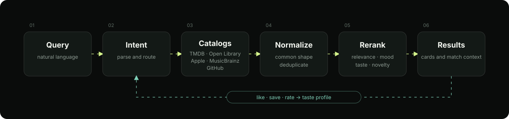
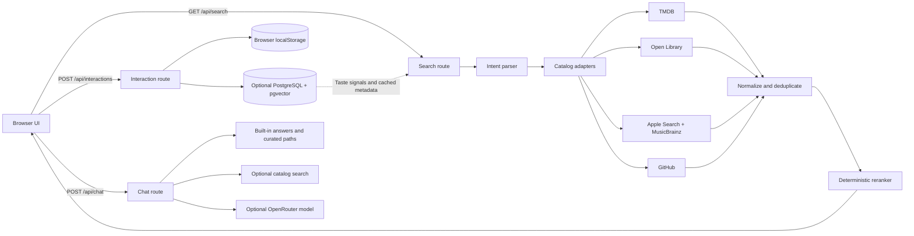

<div align="center">
	
	<br>
	<strong>A cross-medium discovery app that finds the connections between your interests.</strong>
	<br>
	Movies &amp; TV, books, music, and open-source projects, brought together in one evolving taste map.
	<br><br>
	<a href="https://nextjs.org/"></a>
	<a href="https://www.typescriptlang.org/"></a>
	<a href="https://react.dev/"></a>
	<a href="https://www.postgresql.org/"></a>
	<a href="#development"></a>
	<br><br>
	<a href="#overview">Overview</a> ·
	<a href="#features">Features</a> ·
	<a href="#how-discovery-works">How it works</a> ·
	<a href="#your-taste-data">Taste data</a> ·
	<a href="#getting-started">Getting started</a> ·
	<a href="#configuration">Configuration</a>
</div>

## Overview

Most discovery tools treat every search as a separate lookup. **Find Your Niche** treats a search as a signal: describe what you like, explore real catalog results, and follow shared themes into another medium.

Try *"movies like Heat, but darker"*. The query is interpreted as a seed title, crime and noir-related concepts, and a mood modifier. Those signals guide retrieval and ranking; they do not turn a mood into an invented catalog fact. Save, like, or rate discoveries to build a taste profile that can connect films to books, music, and open-source projects.

- **One search across four catalogs.** Search movies and TV, books, music, or code, or let the app route a query from its wording.
- **Recommendations with context.** Results include catalog metadata and signals that explain why an item matched.
- **Real sources, no fabricated catalog entries.** Results come from external catalogs; the app does not make up titles when a source has no match.
- **Useful without an account.** Search, starter discoveries, and a browser-local taste map work without database setup.

## Features

| Feature | What it does |
| --- | --- |
| Exploration sphere | Interactive home screen with a natural-language search and starter discoveries. |
| Cross-catalog search | Search Movies & TV, Books, Music, or Code; use All to route by query cues. |
| Structured filters | Refine supported searches by catalog-specific metadata such as language, region, genre, year, runtime, or experience level. |
| Ranked discovery cards | Browse normalized results with artwork, catalog details, links, and match context. |
| Taste map | Save, like, skip, or rate results; recurring metadata signals shape future discovery. |
| Taste Bridge | With persistent storage, find items in other catalogs connected through shared genres, keywords, and people. |
| Taste chat | Ask about saved signals, get curated cross-medium paths, or look up catalog-backed suggestions. |
| Niche comparison | Create a private, revocable share link to a short taste summary. Links expire after 30 days. |
| Profile and sign-in | Optional Google sign-in and database-backed profile, activity, graph, and discovery clusters. |

### Filters by catalog

| Catalog | Available filters |
| --- | --- |
| Movies & TV | Format, industry/region, language, country, genre, release years, runtime, and mood |
| Books | Language, subject, and publication years |
| Music | Storefront, language, genre, and mood |
| Code | Programming language, topic, and experience level |

Region and industry labels such as Hollywood, Bollywood, and South Indian are retrieval heuristics, not definitive classifications.

<details>
<summary><strong>Example searches</strong></summary>

| Query | Possible interpretation |
| --- | --- |
| `movies like Heat, but darker` | Heat as a seed, with crime/noir and darker-tone retrieval signals |
| `books like Dune` | Related books using catalog subjects and seed metadata |
| `songs like Radiohead` | Music discovery using artist relationships and track metadata |
| `beginner Python RAG projects` | GitHub repository search with language and experience cues |
| `music for late-night reading` | Music discovery guided by activity and mood concepts |

</details>

## How discovery works

<div align="center">
	
</div>

1. **Query.** Enter a natural-language request and choose a catalog, or leave the domain on All.
2. **Interpret.** A bounded deterministic parser extracts the domain, intent, seed, topics, mood, and stated filters. If configured, an OpenRouter model can return structured intent that is validated before use.
3. **Retrieve.** Catalog adapters query TMDB, Open Library, MusicBrainz, Apple Search, or GitHub as appropriate.
4. **Normalize and deduplicate.** Provider records are mapped to a shared result shape and duplicate candidates are combined.
5. **Rank.** A deterministic reranker scores supported evidence such as text relevance, seed similarity, genres, keywords, mood, taste signals, novelty, and diversity.
6. **Explore.** Review metadata, match context, artwork, and links back to the source catalog.
7. **Give feedback.** Likes, saves, and high ratings add taste signals locally or to the configured database.

Search intent includes `SEARCH`, `SIMILAR`, `FILTERED_SIMILAR`, `DISCOVER`, `RECOMMEND`, `CROSS_DOMAIN`, `PERSONALIZED`, `ENTITY_LOOKUP`, and `PEOPLE_SEARCH`. A modifier such as “darker” is treated as a retrieval/ranking signal, not as a factual genre label.

## Your taste data

The app supports a useful local mode and optional persistent features. Local data is not uploaded unless the database-backed features are configured.

| Mode | Where data lives | What it enables |
| --- | --- | --- |
| Browser-local | This browser's `localStorage` | Saved items, likes, high ratings, local taste signals, and personalized search hints. It does not sync between browsers or devices. |
| Persistent | PostgreSQL, scoped to a signed anonymous session | Cross-session profile, interactions, taste graph and clusters, Taste Bridge, and comparison links. |
| Semantic | PostgreSQL with `pgvector`, plus OpenRouter embeddings | Optional embedding-based retrieval over cached catalog metadata. |

In local mode, saves, likes, and ratings of 4 or 5 contribute to taste signals. A local skip is not used to build the taste profile. Persistent storage records interaction events and user/entity state in PostgreSQL. Google sign-in is optional and is only available after its OAuth credentials and the database-backed session configuration are set up.

Taste Bridge connections are derived from metadata shared across saved discoveries, including genres, keywords, and people. Comparison links contain a limited taste summary, can be revoked, and expire after 30 days; they are not a share of search history or account credentials.

## Chat and discovery paths

Chat responds in a bounded sequence: built-in answers, personal taste signals when available, curated cross-domain suggestions, real catalog search for discovery questions, and finally the optional reasoning model for open-ended questions. If a catalog lookup cannot be verified, the app says so rather than presenting an invented result.

The built-in RAG response is an educational explanation of retrieval-augmented generation. The app does not ingest private documents or provide question-answering over a user's files.

## Architecture

The UI is a Next.js App Router application. Client interactions call route handlers under `/api`; provider adapters retrieve public catalog records, the intent parser structures queries, and the reranker orders candidates. PostgreSQL and embeddings are optional.



### Project structure

```text
src/
├── app/
│   ├── page.tsx                 Home, search, results, local taste, chat, and bridge
│   ├── login/                   Optional Google sign-in
│   ├── profile/                 Persistent taste profile
│   ├── compare/                 Shared comparison pages
│   └── api/                     Search, chat, interactions, auth, and other routes
├── components/                  Search, artwork, chat, and comparison UI
└── lib/
		├── intent.ts                Query routing and validated intent
		├── providers.ts              External catalog adapters
		├── ranking.ts                Candidate scoring and ordering
		├── niche.ts                  Taste-signal clustering
		├── db.ts                     Persistence and optional embeddings
		├── inspiration.ts            Curated discovery paths
		└── chat-answers.ts           Built-in chat answers
db/migrations/                    PostgreSQL schema migrations
assets/                           README hero and search-pipeline diagrams
tests/                            Node test-runner tests
```

## Data sources

| Source | Used for | Credentials |
| --- | --- | --- |
| [TMDB](https://www.themoviedb.org/) | Movie and TV search, similar titles, recommendations, people, and metadata | `TMDB_API_KEY` for live movie/TV search |
| [Open Library](https://openlibrary.org/) | Book records, authors, subjects, and publication metadata | No API key in this app |
| [MusicBrainz](https://musicbrainz.org/) | Artist, tag, and relationship metadata | No API key; requests are rate-limited |
| [Apple Search API](https://developer.apple.com/library/archive/documentation/AudioVideo/Conceptual/iTuneSearchAPI/) | Music tracks, albums, artwork, store links, and previews when supplied | No API key in this app |
| [GitHub REST API](https://docs.github.com/en/rest/search/search#search-repositories) | Public repository search and metadata | `GITHUB_TOKEN` is optional and can improve API rate limits |
| [OpenRouter](https://openrouter.ai/) | Optional structured intent, explanations/chat, and embeddings | `OPENROUTER_API_KEY`; provider/model usage may incur charges |

Music previews are only shown when the catalog supplies a preview URL; the app does not stream full tracks. External services may change their availability, quotas, or terms.

## Getting started

### Prerequisites

- Node.js compatible with Next.js 15 and npm
- Network access for live external catalog results
- Optional: PostgreSQL with the `vector` and `pgcrypto` extensions for persistent profiles

### Run locally

```powershell
git clone https://github.com/ShlokMishra01/Find-your-niche-.git
cd Find-your-niche-
npm install
Copy-Item .env.example .env.local
npm run dev
```

For macOS or Linux, replace the copy command with `cp .env.example .env.local`. The app starts at [http://localhost:3000](http://localhost:3000). You can explore the interface and local taste mode without filling in `.env.local`; configure provider credentials to enable the corresponding live integrations.

### Enable persistent profiles

1. Set `DATABASE_URL` to a PostgreSQL database with `pgvector` available.
2. Set `AUTH_SECRET` to a cryptographically random value at least 32 characters long.
3. Run `npm run db:migrate`.

The database role must be allowed to create the `vector` and `pgcrypto` extensions for the initial migration, or an administrator must install them first. The app disables persistent session and interaction storage when the database or valid secret is missing.

### Enable Google sign-in

Configure `GOOGLE_CLIENT_ID`, `GOOGLE_CLIENT_SECRET`, `DATABASE_URL`, and a valid `AUTH_SECRET`. Set the Google OAuth redirect URI to your deployed app's `/api/auth/google/callback` route. Google sign-in is optional; it is not required for local discovery.

## Configuration

Start with `.env.example`. Keep real credentials in `.env.local` or your deployment secret manager; never commit them.

| Variable | Purpose |
| --- | --- |
| `TMDB_API_KEY` | Enables live TMDB movie and TV search. |
| `GITHUB_TOKEN` | Optional GitHub API token for repository search rate limits. |
| `OPENROUTER_API_KEY` | Enables optional model-based intent, chat/explanations, and embeddings. |
| `OPENROUTER_REASONING_MODEL` | Optional model override. Defaults to `nvidia/nemotron-3-ultra-550b-a55b:free`. |
| `OPENROUTER_EMBEDDING_MODEL` | Optional embedding model override. Defaults to `openai/text-embedding-3-small`; the schema expects 1,536 dimensions. |
| `DATABASE_URL` | PostgreSQL connection string for persistent profiles and catalog caching. |
| `AUTH_SECRET` | HMAC signing secret for anonymous sessions; must be at least 32 characters. |
| `GOOGLE_CLIENT_ID`, `GOOGLE_CLIENT_SECRET` | Credentials for optional Google sign-in. |
| `NEXT_PUBLIC_SITE_URL` | Public base URL used when generating comparison links for a deployment. |
| `PGSSL_REJECT_UNAUTHORIZED` | Set to `false` only when the database requires disabling certificate verification. This is not recommended for production. |

Without `OPENROUTER_API_KEY`, query interpretation uses the deterministic parser and built-in/curated chat responses remain available. Embeddings require both a database and an API key. Model and embedding calls can incur provider charges; check the selected provider and model pricing before enabling them.

## API routes

| Route | Purpose |
| --- | --- |
| `GET /api/search` | Interpret, retrieve, rank, and return catalog discoveries. |
| `POST /api/interpret` | Produce grounded result context from returned candidate evidence. |
| `POST /api/chat` | Answer supported questions and suggest discovery paths. |
| `GET /api/session` | Check or create the signed anonymous session when persistence is configured. |
| `GET/POST /api/interactions` | Read or persist user interaction state. |
| `GET /api/taste` | Return observable taste signals for the current session. |
| `GET /api/bridge` | Find metadata-linked discoveries across catalogs. |
| `POST/DELETE /api/compare/share` | Create or revoke an expiring comparison link. |
| `GET /api/compare/[token]` | Read a shared comparison summary. |
| `GET /api/health` | Report service configuration without returning secret values. |

## Development

```bash
npm test
npm run lint
npm run build
```

The tests use Node's test runner through `tsx`. For local PostgreSQL development, apply schema changes with `npm run db:migrate` after setting `DATABASE_URL`.

## Limitations

- Local taste data belongs to one browser and does not sync across devices.
- Taste Bridge, persistent profiles, and database-backed comparisons require PostgreSQL and a valid session secret.
- Live results depend on third-party service availability, network access, and rate limits.
- Industry and region labels are practical retrieval heuristics, not definitive classifications.
- Music results link to provider/store pages; this app does not stream full audio.
- The optional language model helps interpret or explain searches, but catalog facts and recommendation ranking remain grounded in retrieved metadata.
